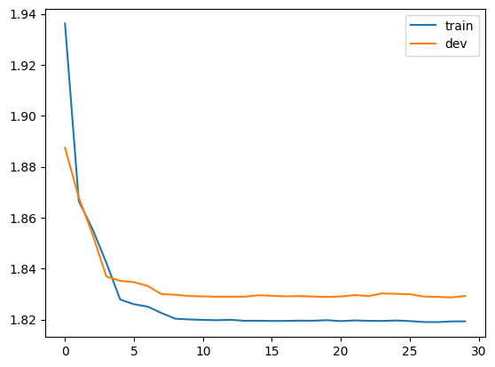
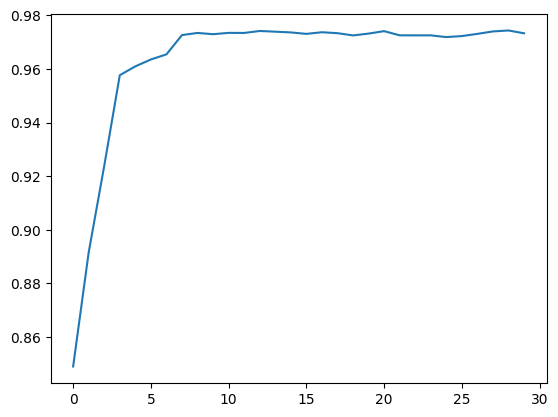
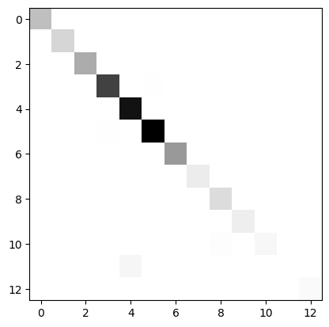

# Neural POS Tagger

## Model Architecture
The model I have used is a birectional LSTM (BiLSTM) model to
generate the tags. The model is trained on the UD banks dataset
and the trained model in available in the file `model.pt`.

## Training
## Parameters for training
```python
WORD_EMBEDDING_DIM = 100
HIDDEN_DIM = 128
DROPOUT = 0.5
NUM_LAYERS = 2
BATCH_SIZE = 32
```
## Loss


## Accuracy


## Test
### Accuracy

test dataset size: 586

```
              precision    recall  f1-score   support

           1       0.99      1.00      1.00       392
           2       0.99      0.99      0.99       256
           3       1.00      0.99      1.00       512
           4       0.99      0.99      0.99      1166
           5       1.00      1.00      1.00      1434
           6       0.98      1.00      0.99      1567
           7       0.99      0.98      0.99       629
           8       0.94      0.91      0.93       127
           9       0.91      0.96      0.93       220
          10       0.99      0.98      0.99       109
          11       0.94      0.66      0.78        76
          12       0.98      1.00      0.99        56
          13       1.00      1.00      1.00        36

    accuracy                           0.99      6580
   macro avg       0.98      0.96      0.97      6580
weighted avg       0.99      0.99      0.99      6580
```
### confusion matrix



## Hyper parameter tuning
### Effect of embedding dimension on accuracy
- E = 10
```
    accuracy                           0.97      6580
   macro avg       0.88      0.86      0.87      6580
weighted avg       0.96      0.97      0.97      6580
```
- E = 50
```
   accuracy                            0.98      6580
   macro avg       0.89      0.88      0.89      6580
weighted avg       0.97      0.98      0.97      6580
```
- E = 100
```
   accuracy                            0.98      6580
   macro avg       0.90      0.88      0.89      6580
weighted avg       0.97      0.98      0.97      6580
```
- E = 500
```
    accuracy                           0.98      6580
   macro avg       0.90      0.89      0.89      6580
weighted avg       0.97      0.98      0.98      6580
```

### Effect of hidden dimension on accuracy

- H = 16

  ```
      accuracy                           0.98      6580
     macro avg       0.90      0.88      0.89      6580
  weighted avg       0.97      0.98      0.97      6580
  ```

- H = 64

  ```
     micro avg       0.98      0.98      0.98      6580
     macro avg       0.90      0.88      0.89      6580
  weighted avg       0.97      0.98      0.97      6580
  ```

- H = 128

  ```
      accuracy                           0.99      6580
     macro avg       0.98      0.96      0.97      6580
  weighted avg       0.99      0.99      0.99      6580
  ```

- H = 256

  ```
     micro avg       0.99      0.98      0.99      6580
     macro avg       0.98      0.96      0.97      6580
  weighted avg       0.98      0.98      0.98      6580
  ```

- H = 512

  ```
  	accuracy                           0.98      6580
     macro avg       0.90      0.89      0.89      6580
  weighted avg       0.97      0.98      0.97      6580
  ```

  